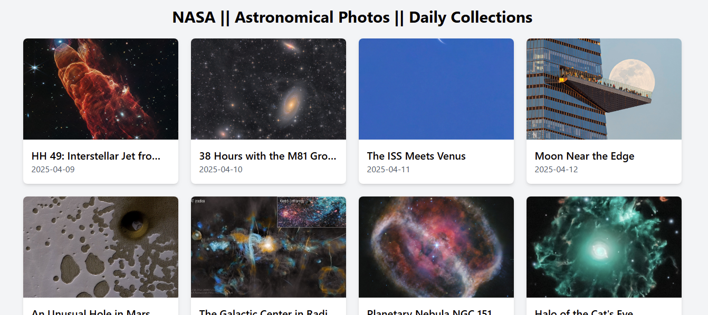

# Astronomical Photos App :milky_way:



A web application for exploring stunning astronomical photos from NASA's APOD (Astronomy Picture of the Day) API or other space-related sources. Discover the cosmos with daily updates, searchable archives, and high-resolution imagery.

---

## Project Structure

The project is organized as follows:

```
astronomical-photos-app/
├── frontend/                     # EJS templates for rendering pages
│   ├── views/              # Reusable EJS components
│   │   ├── partials/           
│   │   ├── detail.ejs         
│   │   └── gallery.ejs 
├── public/
|   |__ assets/               # Static assets
│   ├── css/                
│   ├── js/                
│_ app.js
```

---

## Features

- **Daily Astronomy Photos**: Automatically fetches NASA's APOD or similar API data.

- **Search & Archives**: Browse historical images by date or keyword.

- **Favorites**: Save your favorite photos for offline access.

- **High-Resolution Viewing**: Zoom into images and view metadata (e.g., title, description, date).

Responsive Design: Works seamlessly on desktop, tablets, and mobile devices.
---

## Setup Instructions

1. **Clone the Repository**:

   ```bash
   git clone https://github.com/joemrnice/astronomical-photos-app.git
   cd astronomical-photos-app
   ```

2. **Install Dependencies**:
   Ensure you have Node.js and npm installed. Then, run:

   ```bash
   npm install
   ```

3. **Run the Project**:
   Start the server using:

   ```bash
   npm start
   ```

   The website will be available at `http://localhost:5000`.

4. **Customize Styles**:
   Edit the Tailwindcss files.

---

## Technologies Used

- **Frontend**: ejs / tailwindcss 

- **Backend**: Node.js / Python (optional, if applicable)

- **APIs**: NASA APOD, SpaceX API, or others

---

## Contributing

Contributions are welcome! If you'd like to contribute to this project, please follow these steps:

1. Fork the repository.
2. Create a new branch for your feature or bugfix.
3. Commit your changes and push to your branch.
4. Submit a pull request with a detailed description of your changes.

---

## License

This project is licensed under the MIT License. See the [LICENSE](LICENSE) file for details.

---

## Contact

For any questions or feedback, feel free to reach out:

- **Email**: josephlahaikanumrnice@gmail.com
- **GitHub**: [Joseph Lahai Kanu](https://github.com/joemrnice)

---

Enjoy building and exploring the **Bloggers Network**! 🚀

---
